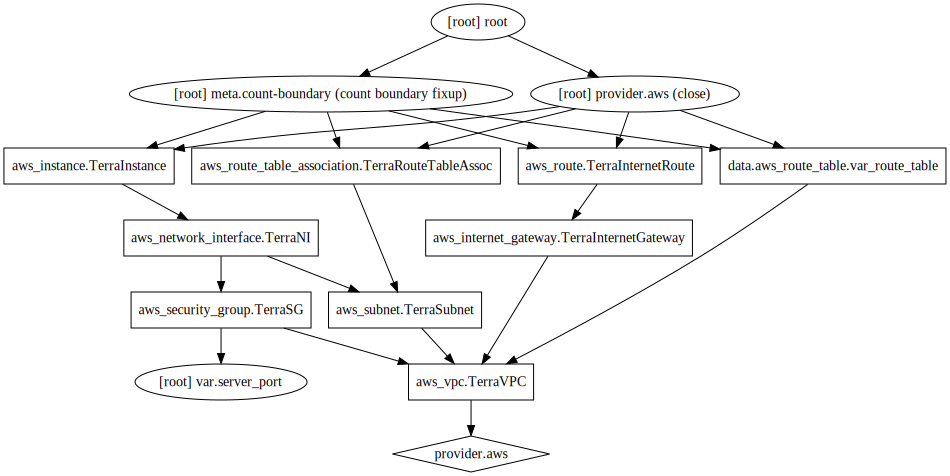

# Automate a simple web server setup on the EC2 instance using Terraform

## What are we creating ?

- Use Terraform to build the infrastructure
  - Create a VPC
    - Use CIDR block: `172.16.0.0/16`
    - This also creates a route table
  - Create an Internet Gateway
    - Associate IG to VPC
  - Create a Subnet
    - Set CIDR block for the subnet to `172.16.1.0/24`
  - Associate the already created route table with the Subnet
  - Create a Security Group
    - Allow HTTP and SSH connections
    - Associate SG to VPC
  - Create a EC2 Network Interface
    - Set private IPs to the ENI
    - Associate SG the the ENI
  - Create an EC2 instance
    - Use Ubuntu AMI
    - Use T2.Micro instance
    - Use an existing keypair
    - Use busybox to start a small HTTP server

### Build/Update infrastructure

```
➜ terraform apply -var 'server_port=8080' -auto-approve
[Lines removed for brevity]

Apply complete! Resources: 8 added, 0 changed, 0 destroyed.
```

### Inspect Terraform state/plan

```
➜ terraform show
```

### Re-apply and nothing will change (if main.tf is not modified)

```
➜ terraform apply -var 'server_port=8080' -auto-approve
[Lines removed for brevity]

Apply complete! Resources: 0 added, 0 changed, 0 destroyed.
```

### SSH to newly created host

```
ssh ubuntu@54.187.13.54
```

### List open files by busybox process

```
ubuntu@ip-172-16-1-100:~$ sudo lsof -p $(pgrep busybox)
COMMAND  PID USER   FD   TYPE DEVICE SIZE/OFF  NODE NAME
busybox 1289 root  cwd    DIR  202,1     4096     2 /
busybox 1289 root  rtd    DIR  202,1     4096     2 /
busybox 1289 root  txt    REG  202,1  2022480   158 /bin/busybox
busybox 1289 root    0r   CHR    1,3      0t0     6 /dev/null
busybox 1289 root    1w  FIFO   0,12      0t0 21566 pipe
busybox 1289 root    2w  FIFO   0,12      0t0 21566 pipe
busybox 1289 root    3u  IPv6  21631      0t0   TCP *:http-alt (LISTEN)
ubuntu@ip-172-16-1-100:~$
```

### Check open ports

```
ubuntu@ip-172-16-1-100:~$ sudo netstat -tlpn
Active Internet connections (only servers)
Proto Recv-Q Send-Q Local Address           Foreign Address         State       PID/Program name
tcp        0      0 127.0.0.53:53           0.0.0.0:*               LISTEN      566/systemd-resolve
tcp        0      0 0.0.0.0:22              0.0.0.0:*               LISTEN      871/sshd
tcp6       0      0 :::8080                 :::*                    LISTEN      1289/busybox
tcp6       0      0 :::22                   :::*                    LISTEN      871/sshd
ubuntu@ip-172-16-1-100:~$
```

### Test the newly created web server

```
➜ curl -I http://54.187.13.54:8080
HTTP/1.0 200 OK
Content-type: text/html
Date: Mon, 12 Nov 2018 22:07:27 GMT
Connection: close
Accept-Ranges: bytes
Last-Modified: Mon, 12 Nov 2018 22:06:25 GMT
Content-Length: 9


~
➜ curl http://54.187.13.54:8080
Success!
```

### Generate graph [needs refactoring for better visualization]

```
➜ terraform graph -draw-cycles  | dot -Tsvg -o  graph.svg
```



### Cleanup

```
➜ terraform destroy -var 'server_port=8080'
[Lines removed for brevity]

An execution plan has been generated and is shown below.
Resource actions are indicated with the following symbols:
  - destroy

Terraform will perform the following actions:

  - aws_instance.TerraInstance

  - aws_internet_gateway.TerraInternetGateway

  - aws_network_interface.TerraNI

  - aws_route.TerraInternetRoute

  - aws_route_table_association.TerraRouteTableAssoc

  - aws_security_group.TerraSG

  - aws_subnet.TerraSubnet

  - aws_vpc.TerraVPC


Plan: 0 to add, 0 to change, 8 to destroy.

Do you really want to destroy all resources?
  Terraform will destroy all your managed infrastructure, as shown above.
  There is no undo. Only 'yes' will be accepted to confirm.

  Enter a value: yes

[Lines removed for brevity]

Destroy complete! Resources: 8 destroyed.
```

